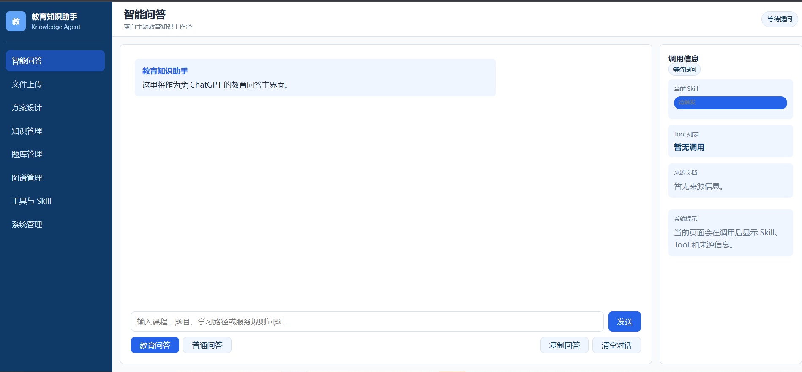

# 智能教育问答与培训系统

智能教育问答与培训系统是一个面向教学资料、课程知识库、培训问答和方案设计场景的 Agent 项目。当前版本已经形成“文档导入 -> 知识抽取 -> 向量/图谱检索 -> 智能问答/教育问答/方案设计 -> 会话记忆与 Token 统计”的完整闭环。

后端以 FastAPI + LangGraph 为主，融合向量检索、知识图谱、教育场景 Skill、规则路由和多步工作流；前端使用 React + Vite + TypeScript，提供问答、方案设计、上传、知识管理、图谱管理、工具与 Skill、系统管理等页面。

## 前端界面



当前前端工作台包含以下主要入口：

- 智能问答：支持普通问答与教育问答模式切换。
- 文件上传：支持单文件与批量导入知识资料。
- 方案设计：面向学习路径、课程大纲、备考计划等场景生成结构化方案。
- 知识管理 / 图谱管理 / 题库管理：用于查看和承接知识库扩展能力。
- 工具与 Skill：展示教育场景下的工具与 Skill 组织方式。
- 系统管理：查看知识统计与更新接口。

前端已经接入当前小任务 Token 展示：问答页和方案设计页都可以看到本次请求的 `total_tokens / prompt_tokens / completion_tokens / llm_calls`。

## 当前架构概览

项目当前由四层组成：

1. `api/`：FastAPI 对外提供上传、问答、教育问答、统计和更新接口。
2. `orchestrator/`：用 LangGraph 编排文档导入、智能问答、教育问答、方案设计、增量更新等工作流。
3. `agents/ + skills/ + tools/`：承载教育问答 Agent、QA Agent、文档解析、知识抽取、教育 Skill 和业务工具。
4. `services/`：承载向量库、知识图谱、Graph RAG、会话记忆、Token 统计与落盘、重排、查询理解等底层服务。

## 项目结构

```text
.
├── agents/              # QA、教育问答、文档解析、知识抽取、增量更新等 Agent
├── api/                 # FastAPI 接口入口
├── config/              # Pydantic Settings 配置
├── frontend/            # React + Vite + TypeScript 前端
├── image/               # README 展示图片
├── orchestrator/        # LangGraph / 工作流编排
├── runtime/             # 会话历史、短时记忆、长时记忆等运行期数据
├── services/            # 检索、图谱、Token 统计、记忆、重排、查询理解等服务
├── skills/              # 教育场景 Skill 定义与注册
├── tests/               # 自动化测试
├── tools/               # Tool 基类、注册表和业务工具
├── uploads/             # 上传文件目录
├── docker-compose.yml   # Neo4j / Chroma / Kafka / API 编排
├── Dockerfile           # 后端镜像构建
├── requirements.txt     # Python 依赖
├── .env.example         # 环境变量模板
└── DO_NOT_UPLOAD.md     # 不应上传 GitHub 的文件/目录说明
```

说明：

- `model_texttotext/`：本地文本生成模型目录，不提交到 GitHub。
- `model_embedding/`：本地 Embedding 模型目录，不提交到 GitHub。
- `logs/`：运行后会生成 Token 明细与按小时聚合日志，默认不应提交。

## 当前核心能力

### 1. 文档导入与知识构建

- 支持单文件上传与批量上传。
- 通过文档解析 Agent 切分文档内容。
- 通过知识抽取 Agent 生成实体、关系和知识块。
- 同时写入向量库与知识图谱。
- 支持后续增量更新流程。

### 2. 智能问答

- 使用 LangGraph 编排 QA 工作流。
- 包含会话记忆加载、意图识别、查询改写、向量检索、图谱检索、重排、答案生成、结果构建等节点。
- 支持普通问答场景下的 RAG + Graph RAG 联合回答。
- 当前已做 Token 优化：
  - 压缩记忆上下文长度。
  - 控制生成阶段注入的检索上下文数量和长度。
  - 对简单问题优先走轻量规则分类/改写，减少不必要的模型调用。

### 3. 教育问答与方案设计

- 教育问答 Agent 支持 Skill 路由。
- 当前内置的主要 Skill 包括：
  - `course_explanation`
  - `question_analysis`
  - `study_plan`
  - `service_qa`
- 教育工作流会根据问题自动判断是否进入“普通教育问答”或“方案设计”流程。
- 方案设计流程基于 LangGraph 的多步 ReAct 风格节点进行技能路由、执行、验证和最终方案生成。

### 4. 会话记忆

- 支持最近对话历史保存。
- 支持短时记忆摘要与长时记忆摘要。
- 支持问答结束后自动刷新短时/长时记忆。
- 当前已经对记忆摘要长度做过压缩，减少生成阶段的 Token 消耗。

### 5. Token 统计与优化

当前项目已经具备完整的 Token 统计链路：

- 统一的 `token_usage_service` 收集单个小任务内的多次模型调用消耗。
- `/api/qa/ask` 与 `/api/education/ask` 会返回统一的 `token_usage` 结构。
- 前端智能问答页、方案设计页可显示当前小任务 Token 用量。
- 后端会在任务结束时自动落盘：
  - `logs/token_usage/YYYY-MM-DD.jsonl`：调用明细
  - `logs/token_usage_hourly/YYYY-MM-DD.json`：按小时聚合
- 当前已完成一轮最小侵入的 Token 优化，重点收敛在：
  - 记忆上下文压缩
  - 检索上下文裁剪
  - 简单问题跳过昂贵改写
  - 教育问答优先规则路由

## 技术栈

### 后端

- Python 3.12
- FastAPI
- Uvicorn
- Pydantic / pydantic-settings
- LangGraph
- LangChain
- langchain-openai

### 检索与知识层

- ChromaDB
- Neo4j
- Kafka
- 可选 PGVector
- sentence-transformers
- transformers
- 本地 Embedding 模型

### 模型与推理

- OpenAI 兼容接口
- 本地文本生成模型
- llama-cpp-python
- tiktoken

### 前端

- React 19
- Vite 6
- TypeScript 5
- React Router 7

### 工程化

- Docker
- Docker Compose
- pytest
- pytest-asyncio
- `.env` 配置管理

## 环境变量

先复制模板：

```powershell
Copy-Item .env.example .env
```

常用配置项如下：

```env
OPENAI_API_KEY=
OPENAI_BASE_URL=
OPENAI_MODEL=

EMBEDDING_PROVIDER=local
LOCAL_EMBEDDING_PATH=

NEO4J_URI=bolt://localhost:7687
NEO4J_USER=neo4j
NEO4J_PASSWORD=

VECTOR_STORE_TYPE=chroma
CHROMA_HOST=localhost
CHROMA_PORT=8000

KAFKA_BOOTSTRAP_SERVERS=localhost:9092

API_HOST=0.0.0.0
API_PORT=8080

UPLOAD_DIR=./uploads
CONVERSATION_HISTORY_FILE=./runtime/conversation_history.json
LOCAL_TEXT_GENERATION_PATH=
```

说明：

- `.env` 只用于本地，不要提交真实密钥。
- `.env.example` 仅保留模板字段。
- 如果使用本地模型，需要自行下载并配置本地路径。

## 启动方式一：Docker 启动后端依赖，前端单独启动

适合快速拉起 Neo4j、ChromaDB、Kafka 与后端 API。

```powershell
Copy-Item .env.example .env
docker compose up --build
```

启动后可访问：

```text
API: http://localhost:8080
Swagger: http://localhost:8080/docs
Neo4j Browser: http://localhost:7474
ChromaDB: http://localhost:8000
```

前端单独启动：

```powershell
cd frontend
npm install
npm run dev
```

前端默认地址：

```text
http://localhost:5173
```

如果后端地址不是默认值，可在 `frontend/.env` 中配置：

```env
VITE_API_BASE_URL=http://localhost:8080
```

## 启动方式二：本地手动启动

如果不使用 Docker，需要你自己准备 Neo4j、ChromaDB、Kafka 或对应替代服务。

后端启动：

```powershell
python -m venv .venv
.\.venv\Scripts\Activate.ps1
pip install -r requirements.txt
Copy-Item .env.example .env
python -m uvicorn api.main:app --host 0.0.0.0 --port 8080 --reload
```

前端启动：

```powershell
cd frontend
npm install
npm run dev
```

## 常用接口

### 健康检查

```powershell
curl http://localhost:8080/api/health
```

### 智能问答

```powershell
curl -X POST http://localhost:8080/api/qa/ask `
  -H "Content-Type: application/json" `
  -d "{\"question\":\"系统里有哪些课程知识？\"}"
```

### 教育问答 / 方案设计

```powershell
curl -X POST http://localhost:8080/api/education/ask `
  -H "Content-Type: application/json" `
  -d "{\"question\":\"请帮我生成一个 Python 零基础学习路径\"}"
```

### 文档上传

```powershell
curl -X POST http://localhost:8080/api/ingest/upload -F "file=@sample.pdf"
```

### 知识更新

```powershell
curl -X POST http://localhost:8080/api/admin/update `
  -H "Content-Type: application/json" `
  -d "{\"file_path\":\"./uploads/sample.pdf\",\"change_type\":\"modified\"}"
```

## 接口返回中的 Token 结构

`/api/qa/ask` 和 `/api/education/ask` 当前会返回：

```json
{
  "token_usage": {
    "task_id": "qa_xxx",
    "prompt_tokens": 123,
    "completion_tokens": 45,
    "total_tokens": 168,
    "cached_tokens": 0,
    "reasoning_tokens": 0,
    "llm_calls": 3
  }
}
```

这部分已经用于前端显示和后端日志落盘。

## 当前已知说明

- 前端已经具备主要工作台页面，但仍在持续迭代。
- 方案设计流程已经接入当前主工作流，不再只是 README 中的规划描述。
- Token 统计、展示、落盘和一轮最小侵入优化已经完成。
- 本地模型、运行期数据、上传文件和日志目录不建议直接提交到 GitHub。

## GitHub 提交注意事项

提交前请确认以下内容不要进入仓库：

- `.env`
- `model_texttotext/`
- `model_embedding/`
- `frontend/node_modules/`
- `uploads/`
- `runtime/`
- `logs/`
- 各类本地测试数据与临时导出文件

详细规则见 [DO_NOT_UPLOAD.md](DO_NOT_UPLOAD.md)。
